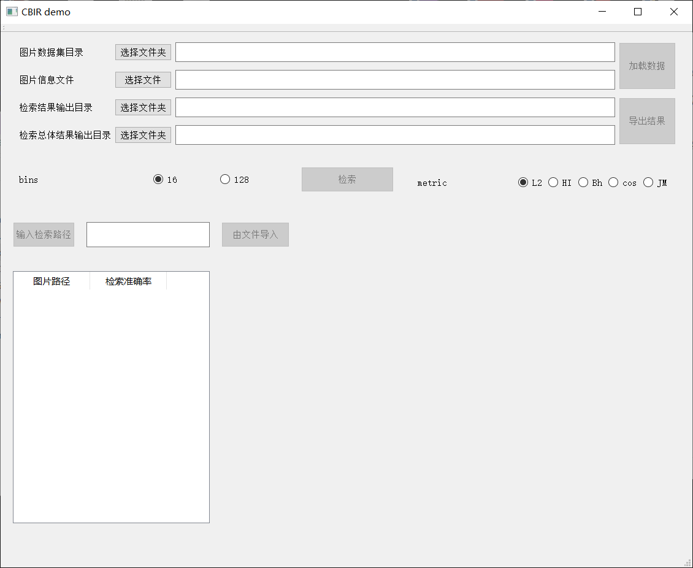
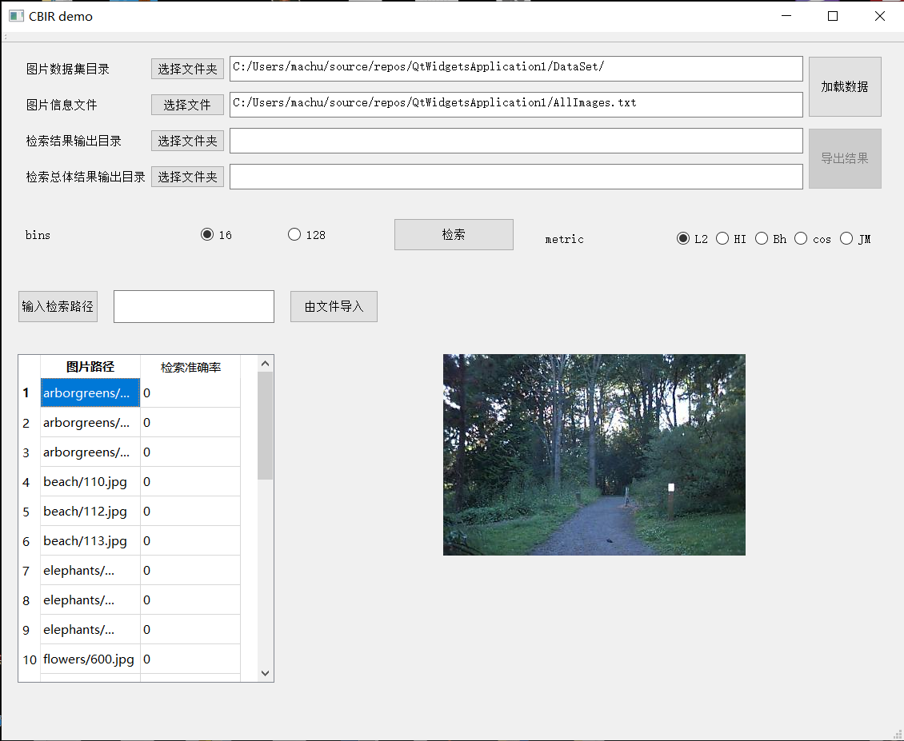
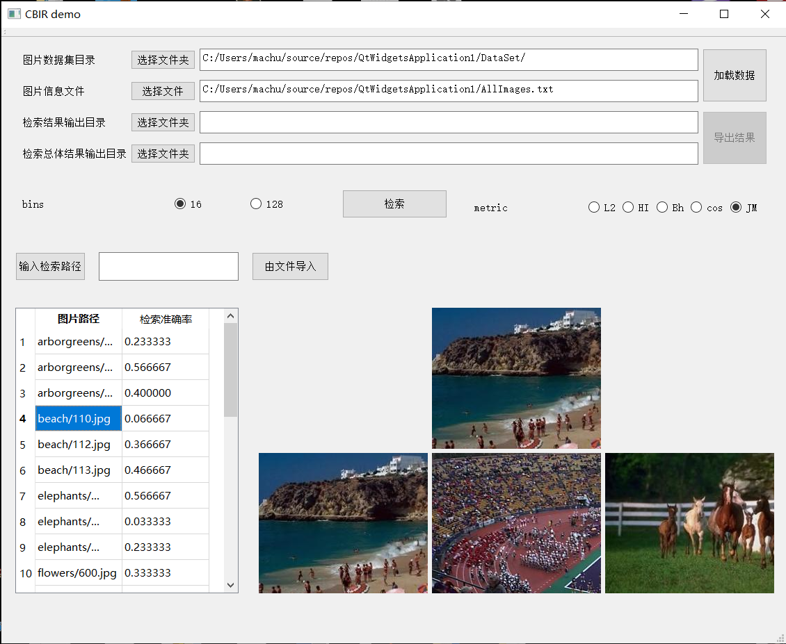
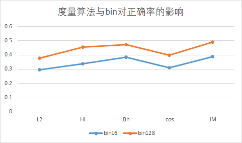
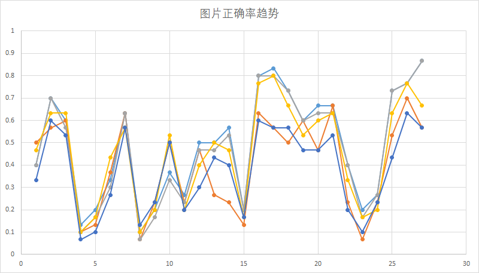
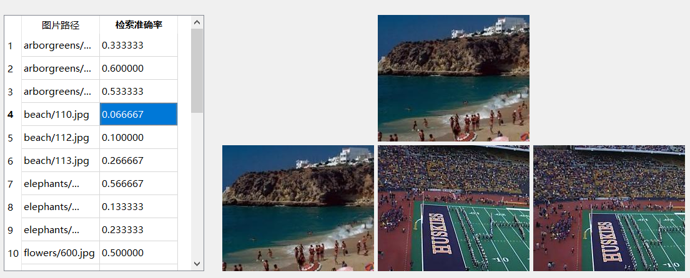
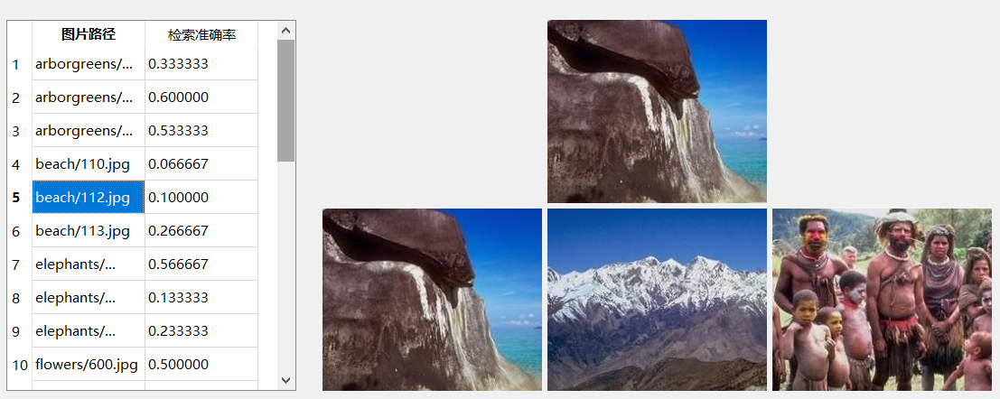

# 图像视频实验二 实验报告

计72 马川 2017011409

## 实验目的与任务

完成基于色彩直方图的图片检索，需要完成下面四个部分：

1. 提取图片特征，计算色彩直方图
2. 计算得到查询图片的直方图特征
3. 利用直方图之间的距离计算图片的相似度
4. 将检索结果按照一定的规则输出

## 实验环境

Windows 10 x86-64

Visual Studio 2019 - MSVC v141

OpenCV 4.3.0

Qt5.12.8 msvc2017_64

## 实验过程

### 度量算法

本次实验中我采用了如下的度量算法进行计算：

* Euclidean(L2) :$$D(P,Q) = \sqrt{\sum_i(p_i - q_i)^2}$$
* Histogram Intersection(HI):$$D(P,Q)=-\sum_imin(p_i,q_i)$$
* Bhattacharyya(Bh):$$D(P,Q)=\sqrt{1-\sum_i{\sqrt{p_iq_i}}}$$
* cosine:$$D(P,Q)=-\frac{P^TQ}{|P||Q|}$$
* Jffreys & Matusita: $$D(P,Q) = \sqrt{\sum{(\sqrt{p_i}-\sqrt{q_i})^2}}$$ 

以上的算法均可以保证求得的距离根据数值的从小到大意味着相似度逐渐变低。

### 实验程序设计

#### 类与结构体设计

##### struct PicInfo

PicInfo 是针对 AllImages.txt 文件中每一行中描述的图片信息设计的储存图片相关数据的结构体。其定义如下：

```cpp
#define BIN_16 (16)
#define BIN_128 (128)
struct PicInfo {
	std::string fileName; //储存 AllImages.txt 文件中的图片名（即相对路径)
	int width = 0;	//文件中的图片长度
	int height = 0; //文件中的图片宽度
	cv::Mat image;	//储存图片像素信息的矩阵
	int hist16[BIN_16] = { 0 }; //储存图片16bins直方图数据的数组
	int hist128[BIN_128] = { 0 }; //储存图片128bins直方图数据的数组
};
```

PicInfo 结构体会记录图片的全部信息，包括其相对路径、长宽、图片矩阵信息以及直方图数据。这样可以使得在之后的程序中多次访问直方图和图片名时减少读取文件的时间。储存图片矩阵 image 用于在设计用户界面时显示对应的图片，减少图片的读取时间。

##### struct Query

Query 结构体描述了一 `QueryImages.txt`中一行查询图片的信息。根据本次实验的特点，所有要搜索的图片时`AllImages.txt`文件中提供的图片，则可以仅计算一次图片的直方图信息即可在查询过程中得到查询图片的直方图数据。Query结构体中包含一个 PicInfo 的指针，用于获取对应查询图片的数据信息。其余部分用于储存查询结果。

```cpp
struct Query {
	const PicInfo* picInfo = NULL; //要查询的图片对应的PicInfo
	double precision = 0; //查询结果的准确性
	std::vector<std::pair<const PicInfo*, double>> results; //最终的30个最佳查询结果
	void clear() {
		precision = 0;
		results.clear();
	}
};
```

##### class PicPool

PicPool 是一个储存 PicInfo 的容器。其可以通过函数`int loadAllImageInfo(std::string allImages)`从给定的文件路径中读取 AllImages.txt 的文件内容并且根据图片的名称从对应的路径中读取图片并且计算对应的直方图。其对外提供接口`PicInfo* findPic(std::string fileName)`利用图片名对图片结构体进行索引。可以通过调整 PicPool 中储存 PicInfo 的数据结构并且修改 findPic 函数的实现来提高索引的速度。

具体实现可以见`PicPool.h`

##### class PicRetriever

PicRetriever 类是执行图片检索功能的主要实现类。其可以通过给定的路径加载全部图片信息以及查询的图片信息。其主要的功能实现函数为：

```cpp
double retrieve(Query* query, DistanceMethod method, int bins, std::string storeDirName); //根据提供的查询图片结构体和提供的参数检索图片结果，并且储存在 query 中
double retriveAll(DistanceMethod method, int bins, std::string storeDirName); //根据读取的全部查询图片信息，检索所有请求，并且将结果储存在对应的结构体中
int dumpQueries(std::string dirName); //将所有储存的检索请求的结果按照要求的格式输出到目标路径
```

其中为了实现最终的检索函数，PicRetriever 中实现了多个度量函数，这些度量函数会在 retrieve 函数中通过函数指针统一调用。如果要添加更多的度量函数，只需要修改对应的枚举类以及retriever函数中对应的函数指针赋值即可，代码修改量较少。

实现的细节请详见`PicRetriever.[h,cpp]`

#### 数据结构及算法设计

###### PicPool 容器类的表现

本次实验中 PicPool 类的表现主要取决于储存 PicInfo 的数据结构以及对应的查找数据的算法。这里仅说明本次实现中采用的方法以及理论上可以提高表现的方法。

在本次实验中 ，PicPool 利用 std::vector 对 PicInfo 进行储存，可以做到访问$$O(1)$$，搜索$$O(n)$$的效率。考虑到本次实验数据集较小，而且搜索操作总共只需要 m 次（m为查询图片的总数量），所以$$O(n)$$的完全遍历来进行搜索的时间开销可以接受。又因为实验中为了得到每个查询图片与所有图片的直方图距离，需要进行$$O(mn)$$的对数据结构直接访问操作，其时间复杂度最低为$$O(nm)$$，故采用$$O(n)$$的搜索算法不会在很大程度上影响最终的结果。

理想状态下应该可以在 PicPool 中建立一个树的结构来建立图片名到 PicInfo 的映射关系。PicInfo 还可以储存在 std::vector 中抱有O(1)的访问时间，同时可以在$$O(mlog(n))$$的时间建立PicInfo与图片名的双向映射，可以在一定程度上减少时间开销。

###### 排序算法的选择

本次实验中，检索过程中的排序算法会较大程度上影响运行效率。在查找每一个图片时，图片都需要对长度为O(n)的序列进行排序，最差会达到$$O(n^2)$$的时间复杂度。

我采取的是一种二分插入排序。考虑到最后的结果只需要距离最小的三十个结果，则可以使用插入排序，将结果插入到结果序列中，如果序列超过30个则删除最后一个。此时的时间复杂度为$$O(log(30)n)\approx O(nlog(n)) \leq O(n^2)$$，具有较高的效率。

#### 实验主流程设计

根据本次实验的要求，程序需要完成的主要流程如下：

1. 构建一个基础的PicRetriever类
2. 调用PicPool的构造函数或者load函数，读取包含**所有图片信息**的文件`AllImages.txt`，将数据储存在数据结构的PicInfo类中
   1. 将每一个图片的数据读取到内存中
   2. 计算图片的两个直方图的值
3. 读取包含**查询信息**的文件`Querys.txt`将数据储存在Query类中
   1. 对于每一条查询信息，找到其对应的图片结构体
4. 对于每一个直方图的子区间个数和统计方法的组合，对每一条Query信息做如下操作：
   1. 利用PicInfo中的直方图数据与Query对应图片进行指定的距离计算
      1. 每计算一个距离便进行一次插入排序
      2. 利用插入排序得到一个按照距离从小到大的距离、编号的数对序列
   2. 根据有序序列，计算前三十个查询结果的准确性（需要求准确性函数）。将**准确性**储存下来
   3. 将前三十个查询结果按照一定规则，输出一个图片最终的结果到目标文件中

#### GUI设计



本次实验我采用了Qt5.12.8进行用户界面设计。设计的用户界面中可以指定读取文件的目录，输出结果的目录，并且可以指定多种不同的检索参数组合。



在加载数据后，可以通过从文件导入获取检索图片信息，或是直接输入图片相对DataSet的路径来添加单独的检索信息。



右侧的图片展示部分会在上部展示选择的检索图片，在下方从左至右输出最佳的三个检索结果图片，从而直观地感受到检索结果是否在内容上与检索图片相一致。

## 实验结果及分析

### 总体的准确率趋势分析

|        | L2       | HI       | Bh       | cos      | JM       |
| ------ | -------- | -------- | -------- | -------- | -------- |
| bin16  | 0.297531 | 0.337037 | 0.383951 | 0.311111 | 0.387654 |
| bin128 | 0.377778 | 0.45679  | 0.471605 | 0.4      | 0.490123 |



以上是本次实验中我采取的度量算法与bins的取值的平均准确率。可以看到总体上准确率均不足50%，其中L2方法度量效果最差，JM度量方法的最好。

从整体的结果上来看，这可能反映了两个问题：

1. 第一个问题是直方图统计的区间太少，无法细粒度展示出图片的颜色特征，从而导致图片的匹配错误。从统计图中可以看出，在直方图区间增加时，图片匹配的正确率也在提升。可以认为，在bin的值提高到某个程度的时候，图片匹配的正确率会达到最大值，之后逐渐下降（极限是对于每一个维度的[0，255]上的每一个整数都设置一个区间，此时两个图片的颜色数量很难完全一致，从而导致正确率变大）
2. 第二个问题是基于RGB色彩空间的单一度量可能无法满足高精度的图片匹配。因为两个图片在颜色上的相似度并不能较大程度上说明两个图片的内容相关：比如说沙滩的图片中可能包含着山的部分，从而山的颜色影响到了沙滩的颜色的占比，从而导致匹配的正确率下降

### 单一组合的结果分析



（具体的数据可以详见data.xlsx/sheet2）

这里选取了bins=128时的所有度量方法对于每一个检索图片的检索结果。可以明显地发现其中有几个图片的检索正确率很低。这里我取其中的几个例子进行分析。



第四个检索内容`beach/110.jpg`的前三个匹配结果里就有两个不正确的分类。通过观察，可以发现图片的大海的颜色与球场的颜色比较接近。这种图片中较大部分的非关键内容特征可能会干扰基于颜色的图片检索的正确率。



第五个检索内容`beach/112.jpg`则可以很明显地发现，虽然归类为沙滩，但是大部分的图片内容是山岩以及蓝天，其中的红褐色部分居多，所以最终的匹配结果也是主要为红褐色。

从上面的两个结果分析可以得出，基于色彩的图像检索会受到图片中占据较大部分的物体的颜色的影响，很难保证其进行匹配的结果在内容上具有一致性。只能说检索结果与原图片在色彩上具有相似度。

### 改进方案

#### 选取合适的直方图区间数

在前面已经讨论过：可以采用比本次实验更多且合适的直方图区间来提高图片匹配的准确性。

#### 选用更好的度量算法

可以看到，在本次实验中采用的JM度量算法可以达到L2算法正确率的1.2倍。这说明对于基于颜色的图片检索而言，度量算法本身会对结果产生较大的影响。可以考虑采取其他的度量算法，或是多种算法混合使用来提高准确率。

#### 增加特征

可以通过引入其他的图片特征，比如计算图片中物体的轮廓来增加图片的匹配特征，使得图片之间的距离能够更好地反映图片的内容之间的相似度。

#### 图片色彩空间转换

在上网查找资料时，我发现绝大部分的色彩直方图统计的均为HSV色彩空间的直方图。将图片的RGB色彩空间转换到HSV空间上有可能可以达到更好的实验效果。在本次实验中没有进行实现。

## 实验结论

本次实验中我实现了基于颜色的图片检索程序。在实验过程中可以很明显地发现该检索算法的局限性，其本身因为色彩对于内容的反映有限从而难以达到很高的准确率。在实验的过程中，我了解了基于直方图的距离计算思想，也明确了如何将RGB色彩空间分为可以进行统计的区间。

## 参考文献

本次实验中，我主要参考了以下的仓库以及文章

1. [https://github.com/Salensoft/thu-cst-cracker/tree/master/%E5%A4%A7%E4%B8%89%E4%B8%8B/%E5%A4%9A%E5%AA%92%E4%BD%93%E6%8A%80%E6%9C%AF/hw/%E5%9B%BE%E5%83%8F%E8%A7%86%E9%A2%91%E5%AE%9E%E9%AA%8C%E4%BA%8C_2012011272_%E8%AE%A122_%E9%BB%84%E6%9D%B0](https://github.com/Salensoft/thu-cst-cracker/tree/master/大三下/多媒体技术/hw/图像视频实验二_2012011272_计22_黄杰)
2. https://jingyan.baidu.com/article/dca1fa6f13bd55f1a44052b9.html
3. https://blog.csdn.net/wc781708249/article/details/78500839
4. https://blog.csdn.net/Felaim/article/details/80702787
5. https://blog.csdn.net/yzy_1996/article/details/81939610
6. https://blog.csdn.net/qq_28351609/article/details/88934471?utm_medium=distribute.pc_relevant.none-task-blog-BlogCommendFromMachineLearnPai2-1.nonecase&depth_1-utm_source=distribute.pc_relevant.none-task-blog-BlogCommendFromMachineLearnPai2-1.nonecase
7. https://blog.csdn.net/liujxken/article/details/86488252
8. https://blog.csdn.net/zong596568821xp/article/details/78999311
9. https://blog.csdn.net/aaa123524457/article/details/78710180
10. https://blog.csdn.net/qinchang1/article/details/86769773
11. https://jingyan.baidu.com/article/455a9950dbb31de167277872.html

